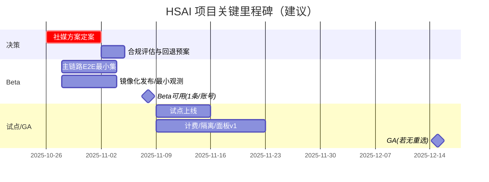

# HSAI 项目关键里程碑（建议甘特图）

> 依据《项目汇报（结论版）》所述建议时间表生成；如需调整，请在此文件直接修改日期并提交。

```mermaid
gantt
  title HSAI 项目关键里程碑（建议）
  dateFormat  YYYY-MM-DD
  section 决策
  社媒方案定案       :crit, a1, 2025-10-26, 7d
  合规评估与回退预案 :a2, after a1, 3d
  section Beta
  主链路E2E最小集    :b1, 2025-10-28, 7d
  镜像化发布/最小观测 :b2, 2025-10-28, 7d
  Beta可用(1条/账号) :milestone, m1, 2025-11-08, 0d
  section 试点/GA
  试点上线            :c1, 2025-11-09, 7d
  计费/隔离/面板v1    :c2, 2025-11-09, 14d
  GA(若无重选)        :milestone, m2, 2025-12-15, 0d
```

变更说明：
- 若 TikTok 合规/技术路线需重选，GA 可顺延至 2026-01 中旬。
- 若 2025-10-26 未能定案社媒方案，整体后续节点顺延 1–2 周。

