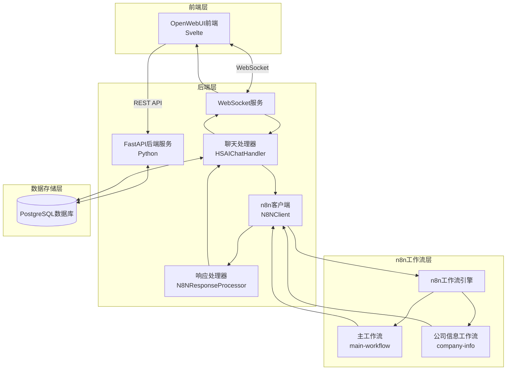

# HSAI系统架构概览

**版本**: v1.0.0  
**更新日期**: 2025-09-03  

## 1. 系统架构图

## 2. 核心组件说明

### 2.1 前端 (OpenWebUI)
- 基于Svelte的现代化Web界面
- 通过WebSocket与后端保持实时通信
- 通过REST API进行数据交互

### 2.2 后端服务 (FastAPI)
- 基于Python FastAPI框架
- 提供REST API接口
- 管理WebSocket连接
- 协调各组件间通信

### 2.3 WebSocket服务
- 处理前端WebSocket连接
- 管理会话状态
- 转发消息到聊天处理器

### 2.4 聊天处理器 (HSAIChatHandler)
- 处理来自WebSocket的消息
- 根据消息内容路由到合适的工作流
- 管理会话和执行记录

### 2.5 n8n客户端 (N8NClient)
- 负责与n8n工作流引擎通信
- 发送HTTP请求到工作流webhook
- 处理响应和错误

### 2.6 响应处理器 (N8NResponseProcessor)
- 处理n8n返回的原始响应
- 结构化处理数据
- 格式化为客户端可用格式

### 2.7 n8n工作流引擎
- 执行具体业务逻辑
- 提供Webhook接口
- 返回处理结果

## 3. 数据流向

### 3.1 正常流程
1. 前端通过WebSocket发送消息到后端
2. WebSocket服务将消息转发给聊天处理器
3. 聊天处理器根据消息内容选择工作流
4. n8n客户端调用相应工作流的webhook
5. n8n工作流引擎处理业务逻辑并返回结果
6. n8n客户端接收结果并传递给响应处理器
7. 响应处理器格式化数据后返回给聊天处理器
8. 聊天处理器通过WebSocket将结果发送回前端

### 3.2 错误流程
1. 在任何步骤出现错误都会被捕获
2. 错误信息会被记录并格式化
3. 通过WebSocket发送错误消息给前端
4. 前端根据错误信息进行相应处理

## 4. 通信协议

### 4.1 WebSocket通信
- 使用标准WebSocket协议
- 消息格式为JSON
- 支持双向实时通信

### 4.2 HTTP通信
- 后端与n8n之间使用HTTP/HTTPS
- 通过Webhook触发工作流
- 支持超时和重试机制

## 5. 安全机制

### 5.1 认证授权
- WebSocket连接需要有效的认证token
- 每个用户只能访问自己的数据和会话

### 5.2 数据传输安全
- 支持HTTPS加密传输
- 敏感信息进行适当处理

### 5.3 访问控制
- 基于用户身份的访问控制
- 工作流调用权限验证