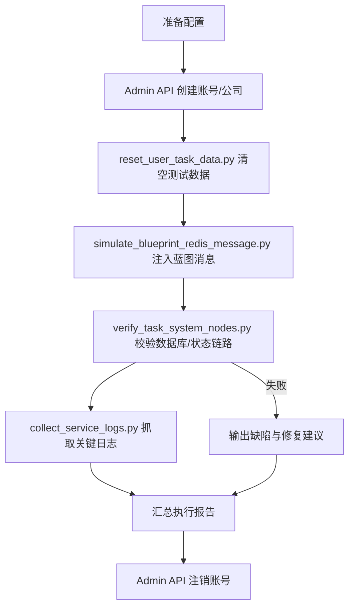

# 任务系统自动化测试修复方案（2025-11-06）

## 1. 背景与目标
- 依据 `docs/task_system_design.md` 的链路要求，构建可重复执行的自动化测试修复流程。
- 通过管理员开放 API 管理测试账号/公司，借助 Redis 队列模拟蓝图数据，验证服务端任务链路。
- 所有测试步骤固化为脚本，支持未来专项/回归测试；执行过程与结论输出为报告并同步 WIKI。

## 2. 流程架构

## 3. 脚本与模块清单
1. `tool/admin_user_lifecycle.py`
   - 依赖 Admin API：POST `/admin/users`、DELETE `/admin/users/{id}`；若接口缺失需在 FastAPI 路由中实现。
   - 功能：随机生成账号（含公司名称）、注销测试账号；支持 `--dry-run`、`--config`。
2. `tool/orchestrate_task_system_auto_test.py`
   - 负责加载配置、串联全部脚本、控制循环重试、记录每个阶段的标准化日志。
   - CLI：`python tool/orchestrate_task_system_auto_test.py --config configs/task_system_auto_test.toml --max-retry 2`。
3. `tool/verify_task_system_nodes.py`
   - 连接 PostgreSQL（使用项目统一 DB 配置），校验 `hsai_tasks`、`hsai_blueprint_progress`、`hsai_task_state_logs`、`hsai_outbox_events`。
   - 输出 JSON/表格，包含状态流转、缺失字段、数量校验。
4. `tool/collect_service_logs.py`
   - 读取配置的日志目录或控制台缓冲，过滤 ERROR/WARNING/自定义关键字，供报告引用。
5. `tool/reset_user_task_data.py`
   - 调整为 PostgreSQL 版本，实现多租户安全删除，保留 `--dry-run`。
6. `tool/simulate_blueprint_redis_message.py`
   - 复用现有脚本，如需参数化 Redis 主机/队列、蓝图模板，在 orchestrator 中注入。

## 4. 配置与安全控制
- 新增 `configs/task_system_auto_test.toml`：
  - `admin_api.base_url`、`admin_api.token`
  - `db.dsn`
  - `redis.host/port/queue`
  - `blueprint.user_seed/company_seed`
  - `verify.poll_interval`、`verify.timeout_sec`
  - `report.output_path`
- 安全措施：
  - 测试账号命名前缀 `auto-task-<timestamp>`，删除环节需显式 `--force`。
  - 报告内敏感信息（token、密码）默认脱敏。

## 5. 验证矩阵
| 阶段 | 验证点 | 工具 | 通过标准 |
| --- | --- | --- | --- |
| 账号创建 | Admin API 返回 201，账号具备公司/项目初始数据 | admin_user_lifecycle | API 响应成功且 DB 存在对应记录 |
| 蓝图触发 | Redis 队列写入成功，任务/蓝图链路启动 | simulate_blueprint_redis_message | Redis lpush 成功，日志出现 handler 消费记录 |
| 数据校验 | 任务/蓝图/状态日志/Outbox 记录匹配预期数量与状态 | verify_task_system_nodes | 校验脚本返回 `status=passed`，无缺失字段 |
| 日志采集 | 服务日志无 ERROR/关键告警 | collect_service_logs | 关键字扫描为空或标记为可接受噪声 |
| 回滚 | 账号、公司、任务数据均被清理 | admin_user_lifecycle + reset_user_task_data | 查询无残留记录 |

## 6. 报告与文档策略
- `reports/task_system_auto_test_report_TEMPLATE.md`：统一记录输入参数、执行时刻、校验结果、缺陷列表、修复动作。
- orchestration 每次运行生成 `reports/task_system_auto_test_report_<timestamp>.md`，并在结束后更新 `docs/task_system_auto_test_log.md` 追加执行摘要。
- `PROJECTWIKI.md`：新增“任务系统自动化测试流程”章节，引用上述脚本与报告路径；在变更日志记录引入原因。

## 7. 回滚策略
1. 代码：通过 git revert 对应提交。
2. 数据：`reset_user_task_data.py --user-id <id> --force-postgres` + Admin API 删除账号。
3. 配置：恢复 `configs/task_system_auto_test.toml` 的 Git 版本；报告文件按需归档或删除。

## 8. 风险与缓解
- Admin API 权限不足：在 orchestrator 中增加预检，失败立即停止。
- PostgreSQL 连接失败：在 verify 脚本中先执行健康检查，失败时输出诊断并跳过后续步骤。
- 自动化脚本并发执行互相影响：通过配置唯一命名前缀和锁文件机制（可选）。
- 报告生成异常：即使执行失败，也将中间结果序列化为 JSON 备份。
