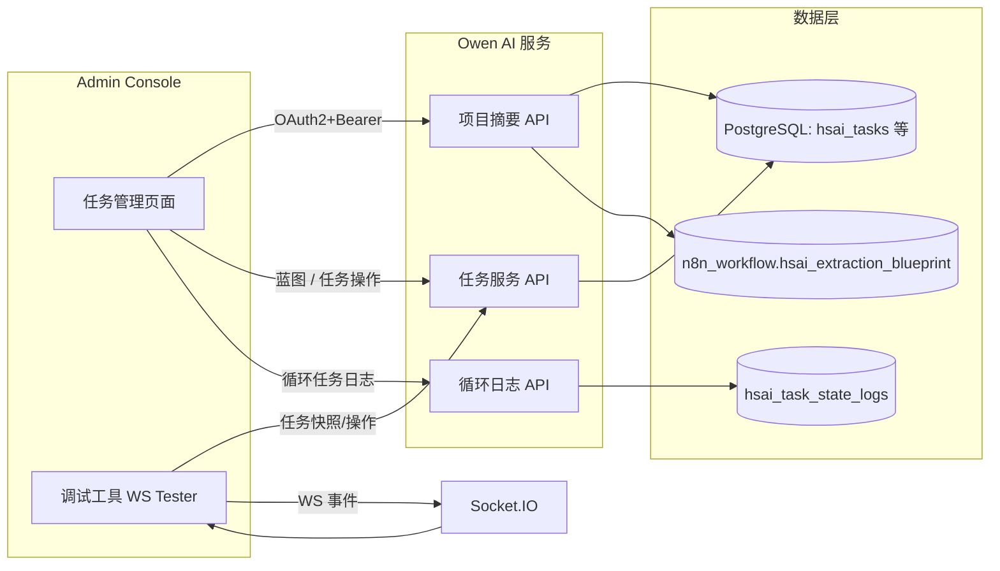

# 任务系统设计说明（2025-10-30）

> 参考：`docs/backend_service_alignment_report_2025-10-30.md`、`docs/backend_service_api_mapping.md`、`docs/backend_service_integration.md`、`docs/plan_ws_tester_frontend_only.md`、`docs/plan_ws_tester_fullstack.md`、`docs/410_websocket_test_page_manual.md`。本设计用于指导任务系统对接后台控制台与主业务服务的迭代，实现“战略蓝图 → 项目摘要 → 主线/循环任务 → 前端调试”闭环。

## 1. 目标
- 保持后台（Admin）与业务服务（Owen AI）之间的数据一致性，所有任务相关操作必须走业务 API，禁止直接改数据库。
- 让后台能够读取“项目+蓝图+任务”摘要，支持主线任务初始化、状态调整、循环任务调度与回放。
- 对接 WebSocket 调试页与后台操作，统一事件通知与审计日志，便于复盘。
- 补足前端（调试页、后台）所需的 REST 接口、模型字段及日志表，提供完备的开发计划与验收标准。

## 2. 架构概览


- **认证**：后台与调试工具统一使用 Client Credentials → JWT，携带 `X-Operator-*` 审计字段，业务端落库。
- **数据流**：蓝图同步服务读取 n8n，写入 `hsai_blueprint_progress` 与任务表；项目摘要 API 聚合蓝图 + 任务完成度；循环任务操作记录写入 `hsai_task_state_logs`，通过 WS 事件推送前端。

## 3. 数据模型与表结构
| 表 | 主要字段（新增*） | 说明 |
| --- | --- | --- |
| `hsai_tasks` | `is_recurring*`、`recurring_state*`、`last_run_at*`、`next_run_at*`、`external_controller*`、`recurring_meta*` | 区分主线/循环任务，记录运行态与外部控制方 |
| `hsai_task_state_logs`* | `id`, `task_id`, `from_state`, `to_state`, `operator_id`, `operator_name`, `source`, `message`, `snapshot_json`, `created_at` | 循环任务状态与调度日志，供后台/调试页查询 |
| `hsai_blueprint_progress` | `blueprint_version`, `progress_state`, `daily_cycle_config`, `last_synced_at` | 已存在，补充项目摘要使用 |
| `hsai_task_blueprint_links` | `template_key`, `metadata` | 蓝图→任务映射，供摘要与重复生成校验 |

> 脚本：新增 `tool/add_recurring_task_fields.py` 执行列/表初始化，支持 dry-run 与重复执行。日志表 index：`task_id` + `created_at`，方便倒序查询。

## 4. API 设计

### 4.1 项目摘要（后台/调试页共用）
```
GET /api/v1/hsai/projects/{project_id}/summary
Authorization: Bearer <token>
X-Operator-Id: <admin_id>
```
返回字段：
- `project`: 基本信息（名称、公司、状态、最近更新时间）。
- `blueprint`: 版本、同步时间、执行时长、截止日期（`last_synced_at + executionDurationDays`）及日程配置。
- `tasks`: 主线任务统计（总数、完成数）、循环任务统计（总数、运行中数量），并返回最近一次循环日志概览。
- `links`: 蓝图与主线任务关联，避免重复生成。

### 4.2 任务操作接口
| 功能 | Method & Path | 请求体 | 响应 | 备注 |
| --- | --- | --- | --- | --- |
| 初始化主线任务 | `POST /api/v1/hsai/tasks` | `{ project_id, template_key }` | 创建任务列表 | 模板 `default_main_tasks` |
| 更新主线状态 | `PUT /api/v1/hsai/tasks/{task_id}` | `{ status }` | 更新后的任务 | 允许 `pending/completed` |
| 启动循环任务 | `POST /api/v1/hsai/tasks/{task_id}/recurring/activate` | `{ next_run_at? }` | 最新状态 + 日志 | 仅 `idle/paused` → `active` |
| 暂停循环任务 | `POST /api/v1/hsai/tasks/{task_id}/recurring/pause` | `{ reason }` | 最新状态 + 日志 | 仅 `active` → `paused` |
| 恢复循环任务 | `POST /api/v1/hsai/tasks/{task_id}/recurring/resume` | `{}` | 状态 + 日志 | `paused` → `active` |
| 外部托管 | `POST /api/v1/hsai/tasks/{task_id}/recurring/handover` | `{ controller, note }` | 状态 + 日志 | `active` → `external_controlled` |
| 同步外部状态 | `POST /api/v1/hsai/tasks/{task_id}/recurring/sync` | `{ state, next_run_at?, last_run_at?, message }` | 状态 + 日志 | 单向校验 |
| 模拟调度 | `POST /api/v1/hsai/tasks/{task_id}/simulate` | `{ schedule_date }` | 新建子任务清单 | 与现有脚本一致 |
| 查看状态日志 | `GET /api/v1/hsai/tasks/{task_id}/recurring/logs?limit=50` | - | `[ {from_state,to_state,message,...} ]` | 倒序返回 |

状态机校验：
- `idle → active → paused → active` 循环。
- `active → external_controlled → active/paused`。
- `completed/failed/cancelled` 视为终态，禁止再操作。

所有接口写入 `hsai_task_state_logs`，并触发 Socket 事件：
```json
{
  "event": "task_status_updated",
  "task_id": "...",
  "status": "active",
  "operator": { "id": "...", "name": "..." },
  "message": "后台触发循环任务启动",
  "context": { "source": "admin_console", "log_id": "..." }
}
```

### 4.3 WebSocket 调试对接
- 调试页刷新任务概览 → 调用摘要 API + `GET /api/v1/hsai/tasks?project_id=...`。
- 循环/主线操作 → 调用对应 REST，按钮在执行期间禁用，操作结果写入“任务操作日志”区域。
- 时间轴新增 `status/progress/error` 分类，接受 `task_status_updated`、`task_recurring_log` 等事件。

## 5. 开发计划
| 阶段 | 工作项 | 输出 | 负责人 |
| --- | --- | --- | --- |
| P0 设计（已完成） | 本文档 + PROJECTWIKI/手册同步 | 设计说明、术语更新 | 架构 |
| P1 后端基础 | ORM 字段、迁移脚本、日志表、枚举 | PR：models、tool/add_recurring_task_fields.py | 后端 |
| P2 API 实现 | 项目摘要控制器、循环状态接口、状态机校验、Socket 通知 | PR：routers/hsai_projects.py、routers/hsai_tasks.py、services/blueprint_sync_service.py、tests | 后端 |
| P3 前端调试页 | 调用摘要新接口、循环操作按钮、日志时间轴增强 | PR：`static/ws-tester.js`、`websocket-test.html`、vitest/手动验证 | 前端 |
| P4 文档同步 | PROJECTWIKI.md、手册、API Mapping 表更新 | 文档更新、验收清单 | 文档 |
| P5 联调 & 上线 | 后台页面改造、CI 端到端脚本、Feature Flag | 联调报告、回滚预案 | 全栈 |

## 6. 验收标准
- **API**：项目摘要返回蓝图、任务统计数据，与数据库记录一致；循环状态接口具备状态机校验及日志。
- **脚本**：`tool/add_recurring_task_fields.py --dry-run` 无报错；重复执行不产生重复列/表。
- **前端**：调试页展示摘要信息，按钮在执行期间禁用，操作成功/失败日志明确可读；事件时间轴展示状态徽章与会话信息。
- **后台**：通过服务端 API 完成主线、循环任务管理，不再直接写数据库；审计日志能准确记录操作者与操作 ID。
- **文档**：手册、WIKI、API Mapping、Integration 文档同步更新并指向最新接口。

---
> 后续里程碑与任务拆解以本设计为基线执行，所有提交需在 `CHANGELOG`、`PROJECTWIKI.md` 中建立代码 ↔ 文档关联。*** End Patch
