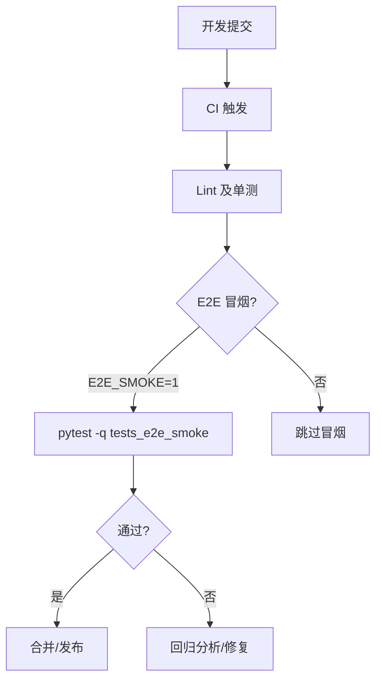
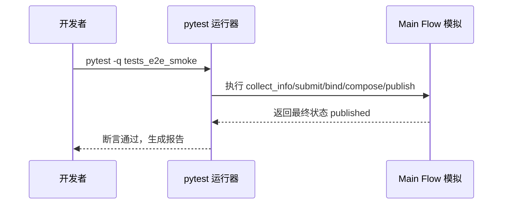
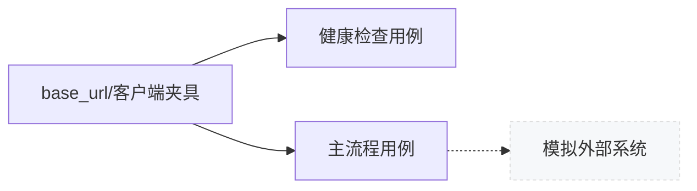

# E2E 测试指导手册（pytest）

> 适用范围：本仓库的端到端（E2E）冒烟与主流程验证。以 pytest 为基础，强调可重复、低脆弱、快速反馈。

更新时间：2025-10-26

## 1. 概览
- 目标与定位：
  - 验证核心业务流程从输入到输出的连贯性与关键契约（接口形状、状态流转、可观测事件）。
  - 以“最小可验证路径（Minimal Viable Path）”为主，避免对外部依赖产生强耦合与不确定性。
- 分层与策略：
  - 单测（逻辑正确性）→ 集成（模块交互）→ E2E（关键用户旅程）三层互补，E2E 只覆盖少量高价值路径。
  - E2E 默认“轻桩化”：对不可控外部系统（第三方平台、支付、社交发布）采用模拟/桩替身。
- 运行时约束：
  - 通过环境变量开关控制“冒烟测试”是否启用：`E2E_SMOKE=1`（默认 1）。
  - 禁止自动加载本机随机 pytest 插件，避免污染（建议设置 `PYTEST_DISABLE_PLUGIN_AUTOLOAD=1`）。



## 2. 当前项目的 E2E 测试
- 目录与文件：
  - `tests_e2e_smoke/test_health_endpoints.py`：对健康检查路径形状的契约校验（无真实 HTTP 调用，保证稳定性）。
  - `tests_e2e_smoke/test_main_flow.py`：主流程“视频发布”端到端的模拟版（以 dataclass 及步骤函数模拟状态流转）。
- 标记与开关：
  - 全部用例带有 `@pytest.mark.e2e_smoke` 标记，便于选择运行。
  - 用例内部通过 `E2E_SMOKE` 环境变量进行快速跳过：非 `"1"` 则 `pytest.skip()`。
- pytest 配置：
  - `pytest.ini` 内容片段：
    - `markers`：定义 `e2e_smoke`。
    - `addopts = -q -p no:langsmith.pytest_plugin`：默认安静输出并显式屏蔽问题插件。
- CI 对应流程：`.github/workflows/ci-minimal.yml` 中设置 `E2E_SMOKE='1'` 并运行 `pytest -q tests_e2e_smoke`。



## 3. pytest 使用指南（项目约定）
- 基本命令：
  - 运行全部冒烟：`pytest -q tests_e2e_smoke`
  - 仅运行健康检查：`pytest -q tests_e2e_smoke/test_health_endpoints.py -k health`
  - 按标记运行：`pytest -q -m e2e_smoke`
  - 显示慢用例：`pytest -q --durations=5`
- 环境变量：
  - 控制开关：`E2E_SMOKE=1`（默认值为 `"1"`）。
  - 建议设置：`PYTEST_DISABLE_PLUGIN_AUTOLOAD=1`，避免本机环境随机插件干扰（Windows 使用 `set`，Linux/Mac 使用 `export`）。
- 选择与过滤：
  - `-k "关键词"` 模糊匹配用例名；`-m 标记` 精确筛选标记。
  - 使用 `xfail/skip` 标注暂不支持或条件跳过的场景，保持报告可读。
- 夹具与结构：
  - 推荐在 `tests_e2e_smoke/conftest.py` 定义共用夹具（如 `base_url`、模拟外部服务、数据生成器）。
  - 避免在夹具中做重 IO 操作；尽量做到快速可复用。
- 报告与输出（可选增强）：
  - `-r a` 打印跳过/预期失败详情；`-vv` 提高详细度。
  - 如需 JUnit 报告（供 CI 平台消费），可追加 `--junitxml=reports/junit-e2e.xml`（自行在 CI 中持久化目录）。

## 4. 如何开发后续 E2E 测试
- 设计原则：
  - “模拟优先、契约第一”：尽量模拟外部接口/副作用，仅验证我们对外暴露的契约与关键状态。
  - “单一关注点”：每个 E2E 用例覆盖一个主干路径，避免把所有分支揉进一个用例。
  - “可重复”：不依赖时序、不依赖外部不可控数据，保证任何机器都能稳定通过。
- 推荐目录与命名：
  - 放在 `tests_e2e_smoke/`，文件以 `test_<场景>.py` 命名。
  - 用例名采用“期望/行为”的自然语言短语，例如：`test_user_can_publish_video()`。
- 典型模板（模拟主干）：
```python
import os
import pytest
from dataclasses import dataclass, field
from typing import List

pytestmark = pytest.mark.e2e_smoke

def _enabled() -> bool:
    return os.getenv("E2E_SMOKE", "1") == "1"

@dataclass
class Scenario:
    account: str
    materials: List[str] = field(default_factory=list)
    status: str = "created"

def step_collect(s: Scenario) -> Scenario:
    s.status = "collected"; return s

def step_bind(s: Scenario) -> Scenario:
    assert s.status == "collected"; s.status = "bound"; return s

def step_compose(s: Scenario) -> Scenario:
    assert s.status == "bound"; s.status = "composed"; return s

def step_publish(s: Scenario) -> Scenario:
    assert s.status == "composed"; s.status = "published"; return s

def test_e2e_publish_flow():
    if not _enabled():
        pytest.skip("E2E_SMOKE disabled")
    s = Scenario(account="tiktok-demo")
    for step in (step_collect, step_bind, step_compose, step_publish):
        s = step(s)
    assert s.status == "published"
```

- 如果需要 HTTP 级别验证（可选）：
  - 方案 A：启动本地服务后，使用 `requests/httpx` 指向 `BASE_URL`（从环境变量或夹具提供）；
  - 方案 B：FastAPI/Starlette 应用内测，使用 `httpx.AsyncClient(app=app, base_url="http://test")`（无需网络、速度快）；
  - 两者都应包装成夹具，统一重试/认证头/默认超时（如 `5s`）。



## 5. 常见问题与排障
- 启动即崩溃：第三方插件自动加载导致 `ModuleNotFoundError`
  - 现象：`No module named 'langsmith.pytest_plugin'` 等。
  - 处理：设置 `PYTEST_DISABLE_PLUGIN_AUTOLOAD=1`，并在 `pytest.ini` 中显式 `-p no:<插件>`。
- 版本冲突：`pip check` 报告依赖不满足
  - 处理：按照约束修正版本；建议在 CI 中添加 `pip check`。
- 用例脆弱：依赖实时外部服务
  - 处理：引入桩件/模拟；仅在“扩展级 E2E”或专门舞台环境中做真实外部验证。

## 6. 验收标准（DoD）与度量
- DoD：
  - 覆盖至少一个“主干用户旅程”的 Happy Path；
  - 运行时间 ≤ 10 秒；可重复；本地与 CI 一致；
  - 使用 `e2e_smoke` 标记并受 `E2E_SMOKE` 控制；
  - 无外部副作用（网络/账单/真实账号）。
- 度量：
  - `--durations=5` 统计最慢用例；
  - 报告稳定性（最近 N 次运行波动 ≤ 5%）。

## 7. 变更记录
- 2025-10-26：首版手册。收敛现有冒烟用例、补充模板与排障指南。

