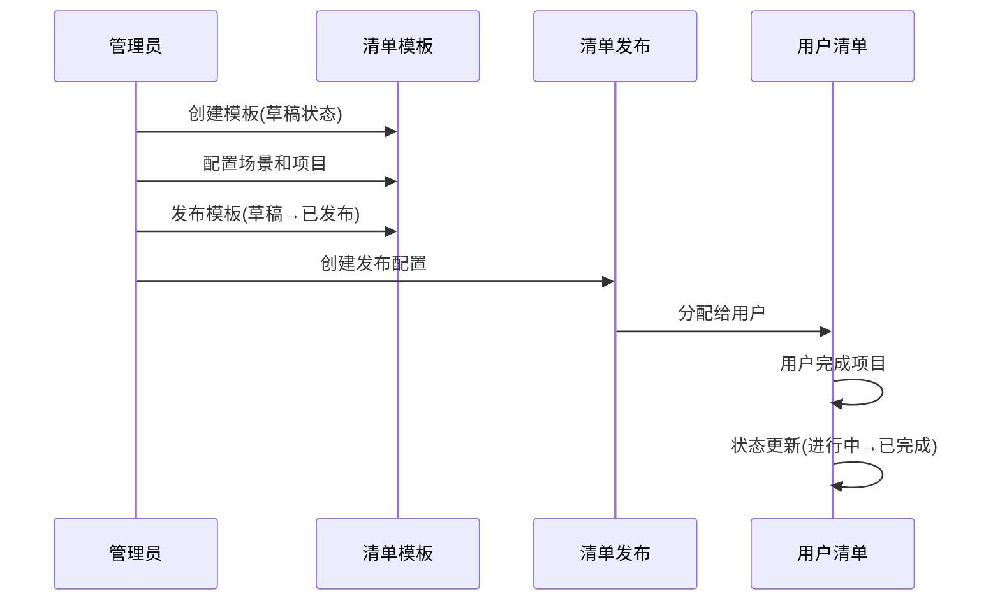
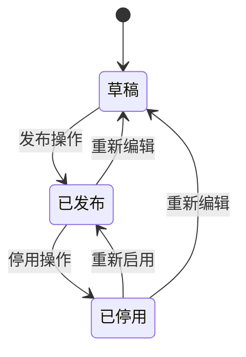
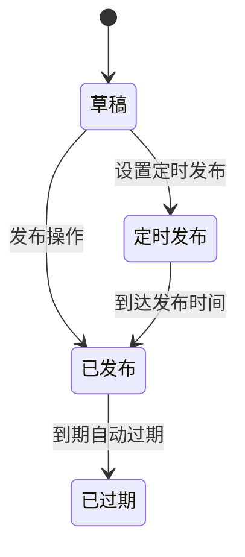
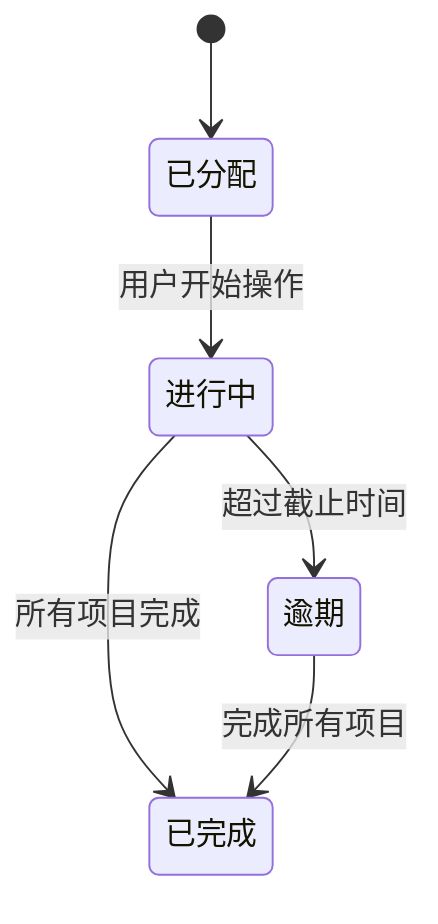
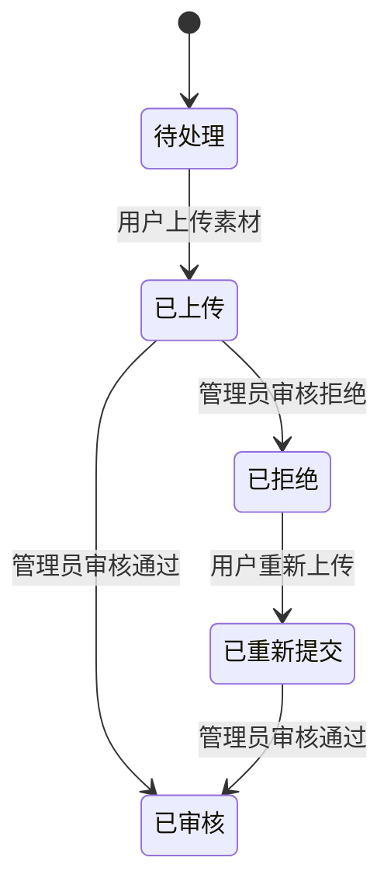
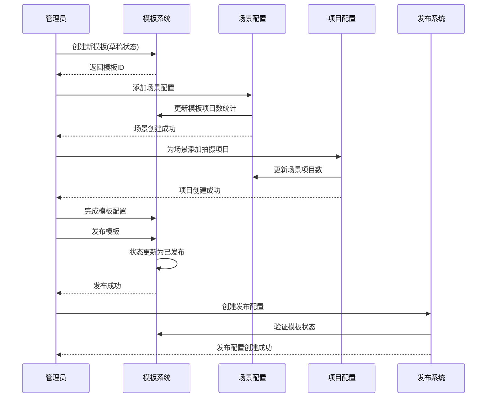
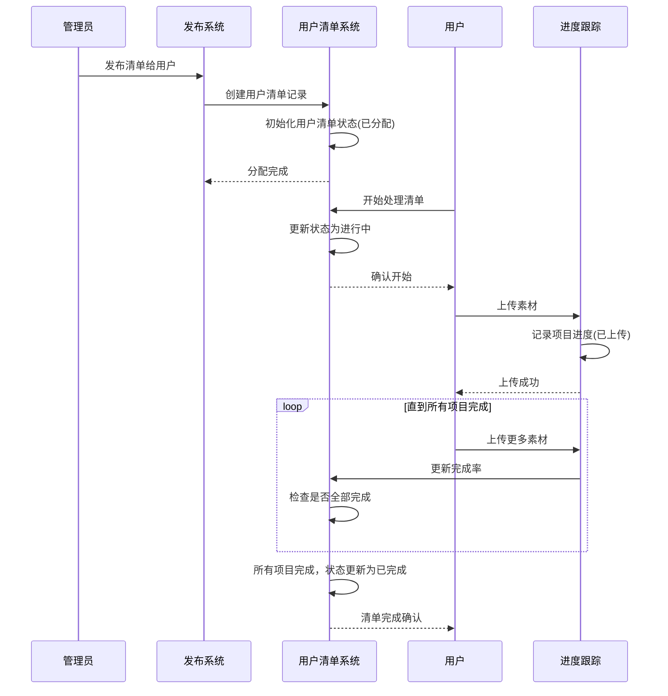
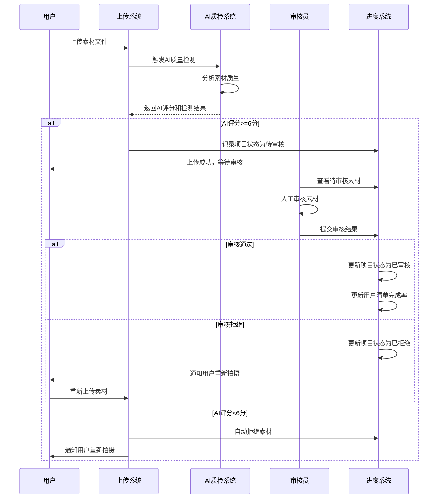
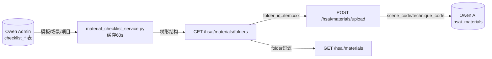

# 素材清单管理模块文档

## 1. 模块概述

素材清单管理模块是Owen AI 后台管理系统的核心功能模块之一，主要用于创建、管理和发布拍摄清单模板，跟踪用户完成进度，并对提交的素材进行质量审核。该模块通过标准化的清单管理，确保用户按照规范要求提交素材，为AI视频拼接提供高质量的素材库。

## 2. 核心功能

### 2.1 清单模板管理
- 模板创建与编辑
- 场景与拍摄项目配置
- 模板状态管理（草稿/已发布/已停用）
- 模板版本控制

### 2.2 清单发布管理
- 模板发布配置
- 用户/企业分配
- 发布状态监控
- 发布记录管理

### 2.3 进度监控管理
- 用户完成度统计
- 场景完成情况跟踪
- 素材质量审核
- 数据分析报告

## 3. 数据模型

### 3.1 清单模板 (ChecklistTemplate)
```python
class ChecklistTemplate(db.Model):
    id = db.Column(db.String(50), primary_key=True)  # 模板ID
    name = db.Column(db.String(200), nullable=False)  # 模板名称
    code = db.Column(db.String(100), unique=True, nullable=False)  # 模板编码
    version = db.Column(db.String(20), nullable=False)  # 版本号
    description = db.Column(db.Text)  # 模板描述
    industry = db.Column(db.Text)  # 适用行业
    company_size = db.Column(db.Text)  # 适用企业规模
    total_items = db.Column(db.Integer, default=0)  # 项目总数
    required_items = db.Column(db.Integer, default=0)  # 必拍项目数
    status = db.Column(db.String(20), default='draft')  # 状态(draft:草稿, published:已发布, disabled:已停用)
    created_by = db.Column(db.String(50))  # 创建人
    created_at = db.Column(db.DateTime, default=datetime.datetime.now)  # 创建时间
    updated_at = db.Column(db.DateTime, default=datetime.datetime.now, onupdate=datetime.datetime.now)  # 更新时间
```

### 3.2 场景 (ChecklistScene)
```python
class ChecklistScene(db.Model):
    id = db.Column(db.String(50), primary_key=True)  # 场景ID
    template_id = db.Column(db.String(50), db.ForeignKey('checklist_templates.id'))  # 所属模板ID
    scene_code = db.Column(db.String(20), nullable=False)  # 场景编码
    scene_name = db.Column(db.String(100), nullable=False)  # 场景名称
    description = db.Column(db.Text)  # 场景描述
    sort_order = db.Column(db.Integer, default=0)  # 排序值
    is_required = db.Column(db.Boolean, default=True)  # 是否为必拍场景
```

### 3.3 拍摄项目 (ChecklistItem)
```python
class ChecklistItem(db.Model):
    id = db.Column(db.String(50), primary_key=True)  # 项目ID
    scene_id = db.Column(db.String(50), db.ForeignKey('checklist_scenes.id'))  # 所属场景ID
    item_code = db.Column(db.String(20), nullable=False)  # 项目编码
    item_name = db.Column(db.String(100), nullable=False)  # 项目名称
    shot_sizes = db.Column(db.Text)  # 景别要求
    camera_movements = db.Column(db.Text)  # 运镜要求
    duration_min = db.Column(db.Integer, default=0)  # 最短时长(秒)
    duration_max = db.Column(db.Integer, default=60)  # 最长时长(秒)
    min_resolution = db.Column(db.String(20), default='1080P')  # 最低分辨率
    priority = db.Column(db.String(20), default='suggested')  # 优先级(required:必拍, suggested:建议, optional:可选)
    description = db.Column(db.Text)  # 拍摄说明
    shooting_tips = db.Column(db.Text)  # 拍摄技巧
    quality_standards = db.Column(db.Text)  # 质量标准
    reference_video = db.Column(db.String(500))  # 参考视频链接
    reference_image = db.Column(db.String(500))  # 参考图片链接
    sort_order = db.Column(db.Integer, default=0)  # 排序值
```

### 3.4 清单发布 (ChecklistPublication)
```python
class ChecklistPublication(db.Model):
    id = db.Column(db.String(50), primary_key=True)  # 发布ID
    template_id = db.Column(db.String(50), db.ForeignKey('checklist_templates.id'))  # 关联模板ID
    title = db.Column(db.String(200), nullable=False)  # 发布标题
    target_type = db.Column(db.String(20), default='all')  # 目标类型(all:全部, specific_users:指定用户, industry:行业, company_size:企业规模)
    target_criteria = db.Column(db.Text)  # 目标筛选条件(JSON)
    publish_time = db.Column(db.DateTime)  # 发布时间
    expire_time = db.Column(db.DateTime)  # 过期时间
    notification_settings = db.Column(db.Text)  # 通知设置(JSON)
    completion_deadline = db.Column(db.Integer, default=30)  # 完成期限(天)
    status = db.Column(db.String(20), default='draft')  # 状态(draft:草稿, scheduled:定时发布, published:已发布, expired:已过期)
    created_by = db.Column(db.String(50))  # 创建人
    created_at = db.Column(db.DateTime, default=datetime.datetime.now)  # 创建时间
```

### 3.5 用户清单 (UserChecklist)
```python
class UserChecklist(db.Model):
    id = db.Column(db.String(50), primary_key=True)  # 用户清单ID
    user_id = db.Column(db.String(50))  # 用户ID
    publication_id = db.Column(db.String(50), db.ForeignKey('checklist_publications.id'))  # 发布ID
    template_id = db.Column(db.String(50), db.ForeignKey('checklist_templates.id'))  # 模板ID
    assigned_at = db.Column(db.DateTime, default=datetime.datetime.now)  # 分配时间
    started_at = db.Column(db.DateTime)  # 开始时间
    completed_at = db.Column(db.DateTime)  # 完成时间
    deadline = db.Column(db.DateTime)  # 截止时间
    status = db.Column(db.String(20), default='assigned')  # 状态(assigned:已分配, in_progress:进行中, completed:已完成, overdue:逾期)
    total_items = db.Column(db.Integer, default=0)  # 项目总数
    completed_items = db.Column(db.Integer, default=0)  # 已完成项目数
    completion_rate = db.Column(db.Numeric(5, 2), default=0.00)  # 完成率
```

## 4. 业务流程与状态流转

### 4.1 模板生命周期



### 4.2 模板状态流转



### 4.3 发布状态流转



### 4.4 用户清单状态流转



### 4.5 项目进度状态流转



## 5. 完整业务流程

### 5.1 模板创建与发布流程



### 5.2 用户清单分配与完成流程



### 5.3 素材审核流程



## 6. 权限控制

### 6.1 模板管理权限
- `system:checklist:template:main` - 模板管理主页面访问权限
- `system:checklist:template:add` - 创建模板权限
- `system:checklist:template:edit` - 编辑模板权限
- `system:checklist:template:remove` - 删除模板权限

### 6.2 发布管理权限
- `system:checklist:publication:main` - 发布管理主页面访问权限
- `system:checklist:publication:add` - 创建发布配置权限
- `system:checklist:publication:edit` - 编辑发布配置权限
- `system:checklist:publication:remove` - 删除发布配置权限

### 6.3 进度监控权限
- `system:checklist:progress:main` - 进度监控主页面访问权限

## 7. API接口

### 7.1 模板管理接口
- `GET /checklist/template` - 模板管理主页面
- `GET /checklist/template/data` - 模板分页查询
- `GET /checklist/template/add` - 新增模板页面
- `POST /checklist/template/save` - 保存模板
- `DELETE /checklist/template/remove/<id>` - 删除模板
- `POST /checklist/template/publish/<id>` - 发布模板
- `GET /checklist/template/edit/<id>` - 编辑模板页面
- `PUT /checklist/template/update` - 更新模板
- `GET /checklist/template/detail/<id>` - 模板详情页面

### 7.2 场景管理接口
- `GET /checklist/template/scene/<template_id>` - 场景配置页面
- `GET /checklist/template/scenes/<template_id>` - 场景分页查询
- `POST /checklist/template/scene/add` - 添加场景
- `DELETE /checklist/template/scene/remove/<id>` - 删除场景
- `PUT /checklist/template/scene/update` - 更新场景

### 7.3 项目管理接口
- `GET /checklist/template/item/<scene_id>` - 项目配置页面
- `GET /checklist/template/items/<scene_id>` - 项目分页查询
- `POST /checklist/template/item/add` - 添加项目
- `DELETE /checklist/template/item/remove/<id>` - 删除项目
- `PUT /checklist/template/item/update` - 更新项目

### 7.4 发布管理接口
- `GET /checklist/publication` - 发布管理主页面
- `GET /checklist/publication/data` - 发布记录分页查询
- `GET /checklist/publication/add` - 新增发布配置页面
- `POST /checklist/publication/save` - 保存发布配置
- `DELETE /checklist/publication/remove/<id>` - 删除发布记录
- `GET /checklist/publication/edit/<id>` - 编辑发布配置页面
- `PUT /checklist/publication/update` - 更新发布配置
- `POST /checklist/publication/publish/<id>` - 发布操作

### 7.5 进度监控接口
- `GET /checklist/progress` - 进度监控主页面
- `GET /checklist/progress/data` - 用户进度分页查询

## 8. 清单驱动的素材接口映射（2025-11-08）

| 前端接口 | 行为 | 备注 |
| --- | --- | --- |
| `GET /hsai/materials/folders` | 返回根据 Admin 发布的模板→场景→项目树，而非用户自建目录。 | 节点 ID 采用 `template:<id>` / `scene:<id>` / `item:<id>`，并在响应中新增 `node_type/template_code/scene_code/item_code/shot_sizes/...` 字段。 |
| `GET /hsai/materials` | 仍沿用原参数，但当 `folder_id` 传入上述前缀时，会自动按场景/项目编码过滤素材列表。 | `scene_code`、`technique_code` 字段沿用：场景与项目的编码即素材文件名中的 `scene_code`、`technique_code`。 |
| `POST /hsai/materials/upload` | 复用旧表单；若仅提供 `folder_id=item:<id>`，后端会自动填充 `scene_code`、`technique_code`。 | 选择模板节点上传会返回 400，需指定到具体项目。 |
| `GET /hsai/materials/statistics` | `folders_count` 统计基于清单树节点数量，便于观察模板覆盖度。 | 其余统计逻辑不变。 |

### 8.1 节点字段扩展

`HSAIMaterialFolderResponse` 的新增字段：

- `node_type`：`template` / `scene` / `item`，便于前端渲染不同图标。
- `template_code`、`scene_code`、`item_code`：用于与素材记录的 `scene_code`、`technique_code` 对齐，实现“字段复用”。
- `shot_sizes`、`camera_movements`、`duration_min/max`、`min_resolution`、`priority`、`shooting_tips`、`quality_standards`、`reference_video`、`reference_image` 等：直接将拍摄要求下发到前端，减少再次查表。

### 8.2 流程图



### 8.3 兼容与回滚

- 旧的 `hsai_material_folders` 数据仍保留，但不会再在接口中返回；若需回滚，可通过恢复旧版 `hsai_materials.py` 路由或在 `material_checklist_service` 中增加特定开关。
- 默认缓存 60 秒，可根据业务需要通过环境变量在 `material_checklist_service` 中调整。
- 当 Admin 尚未向企业下发任何清单时，接口返回空数组，前端可提示管理员先发布模板。
