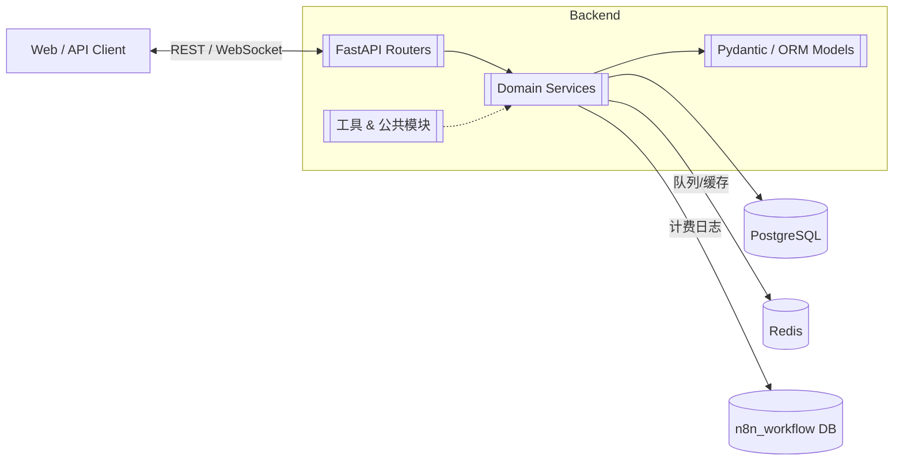
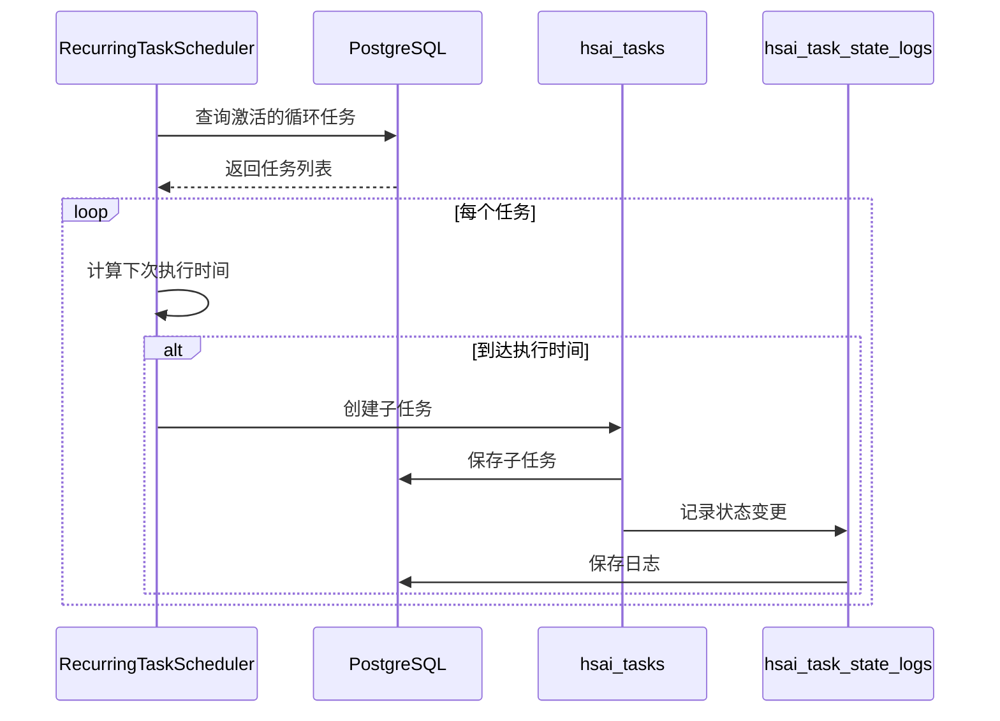
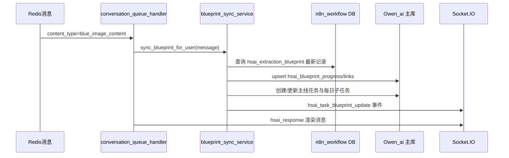

# 任务系统设计方案

## 1. 概述

本方案旨在设计和实现一个完整的任务系统，包括任务创建、管理、执行和监控等功能。系统基于公司-项目-任务的多租户模型构建，支持主线任务和循环任务两种类型。

## 2. 系统架构

### 2.1 总体架构



### 2.2 核心组件

1. **任务模型**：定义任务的基本属性和行为
2. **任务服务**：处理任务的创建、更新、查询等业务逻辑
3. **任务调度器**：负责循环任务的自动调度和执行
4. **消息队列处理器**：处理来自Redis队列的任务相关消息
5. **蓝图同步服务**：同步战略蓝图并生成相关任务

## 3. 数据模型设计

### 3.1 任务表 (hsai_tasks)

```mermaid
erDiagram
  hsai_tasks {
    string id PK
    string title
    string task_type
    string status
    string user_id FK users.id
    string project_id FK hsai_projects.id
    bigint progress
    bool is_recurring
    string recurring_state
    bigint last_run_at
    bigint next_run_at
    string external_controller
    json recurring_meta
    timestamptz created_at
    timestamptz updated_at
  }
```

### 3.2 蓝图进度表 (hsai_blueprint_progress)

```mermaid
erDiagram
  hsai_projects ||--o{ hsai_blueprint_progress : "跟踪蓝图"
  hsai_blueprint_progress ||--o{ hsai_blueprint_progress_history : "版本历史"
  hsai_blueprint_progress ||--o{ hsai_task_blueprint_links : "生成主线任务"
  hsai_tasks ||--o{ hsai_task_blueprint_links : "蓝图来源"
  hsai_tasks ||--o{ hsai_task_state_logs : "状态日志"

  hsai_blueprint_progress {
    string id PK
    string project_id FK hsai_projects.id
    string blueprint_version
    string progress_state
    json daily_cycle_config
    json latest_digest
    bigint last_synced_at
  }
  hsai_blueprint_progress_history {
    string id PK
    string progress_id FK hsai_blueprint_progress.id
    string operation
    json changes_json
    bigint created_at
  }
  hsai_task_blueprint_links {
    string id PK
    string progress_id FK hsai_blueprint_progress.id
    string task_id FK hsai_tasks.id
    string template_key
    json metadata
    bigint created_at
  }
  hsai_task_state_logs {
    string id PK
    string task_id FK hsai_tasks.id
    string from_state
    string to_state
    string operator_id
    string source
    bigint created_at
  }
```

## 4. 核心功能设计

### 4.1 任务创建与管理

#### 4.1.1 任务创建流程

1. 用户通过API创建任务
2. 系统验证任务参数
3. 生成任务记录并保存到数据库
4. 返回创建结果

#### 4.1.2 任务更新流程

1. 用户通过API更新任务
2. 系统验证更新参数
3. 更新任务记录
4. 记录任务状态变更日志
5. 通过WebSocket通知前端

### 4.2 循环任务调度

#### 4.2.1 调度机制

循环任务调度器每60秒扫描激活任务，依据`recurring_meta.interval_*`计算下一次执行时间，并按`parent_task_id + scheduled_for`幂等生成子任务。

#### 4.2.2 调度流程



### 4.3 蓝图同步机制

#### 4.3.1 蓝图数据获取

蓝图节点触发时，系统从`hsai_extraction_blueprint`表获取需要的数据：

```python
def _fetch_latest_blueprint_from_n8n() -> Optional[Dict[str, Any]]:
    with get_n8n_db() as db:
        stmt = text(
            """
            SELECT
                id,
                "blueprintVersion",
                "executionDurationDays",
                "plannedTotalPosts",
                "postingFrequency",
                "requiredTiktokAccounts",
                session_id,
                request_id,
                user_id,
                socket_id,
                blue_image,
                "createdAt",
                "updatedAt"
            FROM hsai_extraction_blueprint
            ORDER BY "createdAt" DESC
            LIMIT 1
            """
        )
        row = db.execute(stmt).mappings().first()
        return dict(row) if row else None
```

#### 4.3.2 蓝图进度更新

在蓝图生成到循环任务开启这一阶段，蓝图进度会在以下时间点更新数据：

1. **蓝图同步时**：当收到`blue_image_content`类型的消息时，系统会调用`sync_blueprint_for_user`函数同步蓝图数据
2. **任务链接创建时**：在创建或更新任务链接时更新进度
3. **每日子任务生成时**：在满足条件时生成每日子任务并更新进度

更新流程如下：



## 5. 测试方案

### 5.1 流程测试脚本

为了方便对蓝图以及任务系统的功能进行快速测试，我们提供了两个测试脚本：

#### 5.1.1 模拟发送蓝图节点Redis队列数据脚本

文件路径：`tool/simulate_blueprint_redis_message.py`

该脚本可以模拟发送蓝图节点的Redis队列数据，触发主线任务的创建。

主要功能：
- 生成符合规范的蓝图消息数据
- 发送消息到Redis队列
- 支持自定义用户ID、会话ID、Socket ID等参数

使用方法：
```bash
python tool/simulate_blueprint_redis_message.py --user-id USER_ID [--session-id SESSION_ID] [--socket-id SOCKET_ID]
```

#### 5.1.2 还原用户任务数据脚本

文件路径：`tool/reset_user_task_data.py`

该脚本可以还原用户任务数据，将当前的蓝图数据、任务数据删除，账号还原到触发蓝图节点之前的状态。

主要功能：
- 删除用户的所有任务记录
- 删除用户的蓝图进度记录
- 删除用户的任务蓝图链接记录
- 删除用户的项目记录
- 删除用户的公司记录
- 删除用户的任务状态日志
- 重置用户的信息收集状态
- 支持dry-run模式预览将要执行的操作

使用方法：
```bash
python tool/reset_user_task_data.py --user-id USER_ID [--db-path DB_PATH] [--dry-run]
```

### 5.2 单元测试

#### 5.2.1 任务模型测试

测试任务模型的基本功能，包括创建、更新、查询等。

#### 5.2.2 任务服务测试

测试任务服务的业务逻辑，包括任务创建、更新、删除等。

#### 5.2.3 调度器测试

测试循环任务调度器的功能，包括任务调度、子任务生成等。

## 6. 部署与运维

### 6.1 部署方案

系统支持Docker容器化部署，可以通过docker-compose快速启动。

### 6.2 监控建议

- 重点观测`credit`/`credit_log`同步延迟
- 监控Redis Stream消费积压
- 监控n8n数据库链路

### 6.3 故障处理

- 提供数据库修复脚本，如`tool/fix_hsai_video_learning_status_sequence.py`
- 提供Redis队列修复脚本，如`tool/test_redis_queue_insert.py`

## 7. 安全与权限

### 7.1 权限控制

系统采用JWT/OAuth2 Bearer/API Key等多种鉴权方式，确保只有授权用户才能访问相关资源。

### 7.2 数据隔离

通过公司维度进行数据隔离，确保不同公司之间的数据互不干扰。

## 8. 性能优化

### 8.1 数据库优化

- 合理使用索引提高查询性能
- 对大表进行分页查询避免性能问题

### 8.2 缓存优化

- 使用Redis缓存热点数据
- 合理设置缓存过期时间

## 9. 未来扩展

### 9.1 功能扩展

- 支持更多类型的任务
- 增加任务依赖关系管理
- 提供任务模板功能

### 9.2 性能扩展

- 支持水平扩展
- 提供更高效的调度算法